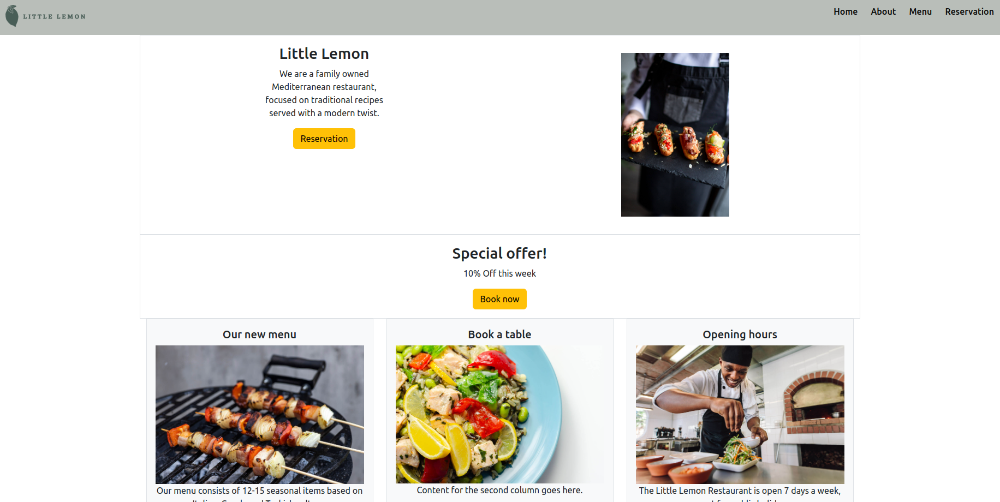

# Little Lemon Restaurant Website with React
Developed a responsive website for Little Lemon to practice basic React concepts. The project includes:

- Home: General information about the restaurant.
- About: History and mission of the restaurant.
- Menu: Dynamically rendered dishes with descriptions and images.
- Reservation: A form for booking tables, practicing form handling and state management.

**Technologies**: React, React-Bootstrap, CSS.
Learning Focus: Component-based architecture, props, state, dynamic rendering, and responsive design.

```
npm install 
npm install react-bootstrap bootstrap
```

